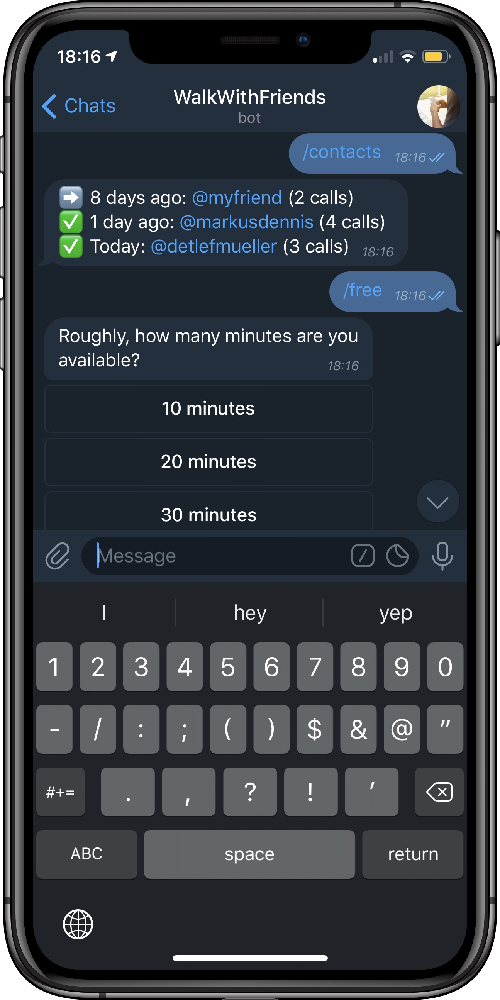
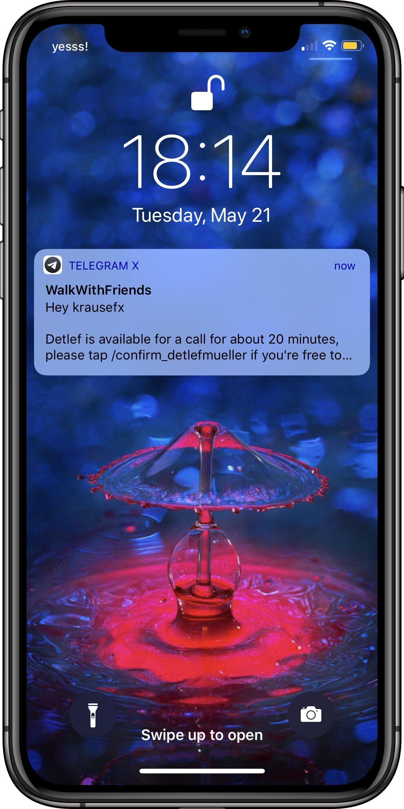
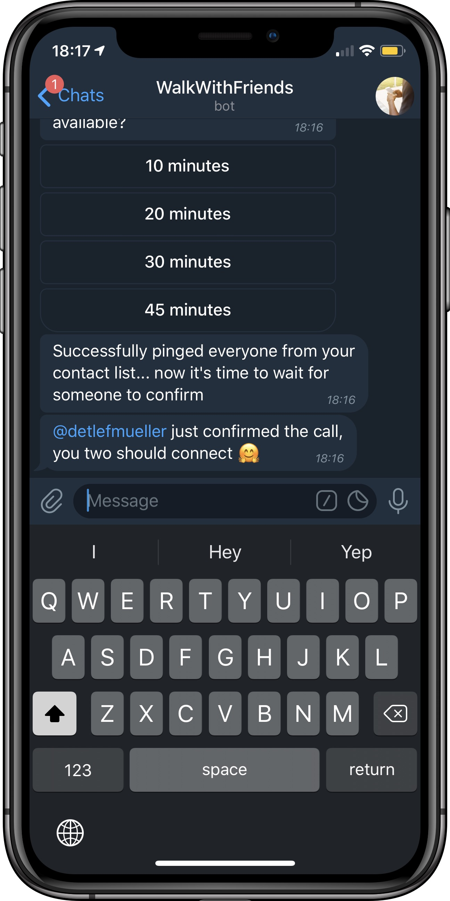

# WalkWithFriends

Staying in touch with close friends requires more effort when everybody lives somewhere else on the planet. Scheduling calls to catch up certainly works, but it requires time-commitment, and time zones make scheduling unnecessarily complicated.

After living in NYC for a year, I ended up doing the following: If I walk somewhere for about 30 minutes, I'd text 2 friends or family members, asking if they're available for a chat. Often one of them would end up calling me. This way, no prior planning was necessary, things felt more spontaneous and I was able to use my NYC walking time to catch up.

## The problems

- If I text a friend `Hey X, are you free for a call?`, chances are they're at work, asleep, with friends or don't look at their phone. They'd see my message 2 hours later and reply `Yep, sure, calling you now`. The problem here is that by that time I'm unavailable, as the message is from 2 hours ago. 
- If a friend doesn't know about this setup, they'd think I want to discuss something specific or urgent, however those kinds of calls are just to catch up and stay in touch.
- Often, either none of my friends were available, or multiple responded, so it was always a tricky balance on how many friends I'd text, with the risk of both of them replying `Yep, I'm free now`
- If one friend is never available, you kind of "forget" to text them, as you already assume subconsciously that they won't be available

## The solution

A Telegam bot that manages the communication and revokes messages as soon as you're unavailable again. 

<h3 style="text-align: center; font-size: 35px; border: none">
  <a href="https://t.me/WalkWithFriendsBot" target="_blank" style="text-decoration: none;">
    🔰 Start using the bot 🔰
  </a>
</h3>

<table>
  <tr>
    <td>
      
    </td>
    <td>
      
    </td>
    <td>
      
    </td>
  </tr>
</table>

**How does it work**:

1. Say hi to the bot via [t.me/WalkWithFriendsBot](https://t.me/WalkWithFriendsBot)
1. You add all the Telegram contacts using `/newcontact [username]`
1. You type `/free` to mark yourself as available
1. You tell the bot how many minutes you'll be free (this number will be sent as part of the message to your friends)
  1. The bot now sends out messages to all your friends in your contact list, one message every 20 seconds
  1. The order in which the messages are sent is based on when you last had a call with them, to prefer people you haven't chatted in a while
1. As soon as your first friend hits the `/confirm` button
  1. You and your friend will be connected
  1. All other invites will be revoked, meaning if e.g. the friend was sleeping during that time, they won't even see that there ever was a message

**Why Telegram?**

- It works on every major platform, including iOS, Android and macOS
- It supports revoking of messages and notifications, even from the lock screen
- They have a solid bots API
- Registration for new users is easy & fast

<h3 style="text-align: center; font-size: 35px; border: none">
  <a href="https://t.me/WalkWithFriendsBot" target="_blank" style="text-decoration: none;">
    🔰 Start using the bot 🔰
  </a>
</h3>

  <iframe width="300" height="580" src="https://www.youtube.com/embed/vanxPbuKTQQ" frameborder="0" allow="accelerometer; autoplay; encrypted-media; gyroscope; picture-in-picture" allowfullscreen></iframe>

 

  <small>Website generated using <a href="https://markdown-to-github-style-web.com/" target="_blank">markdown-to-html-github-style.com</a></small>

